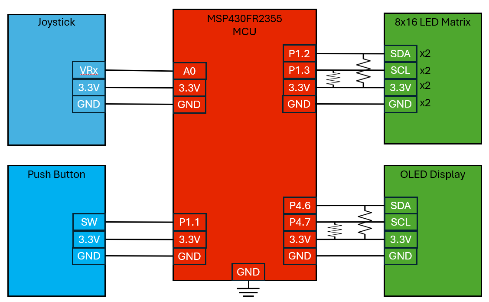
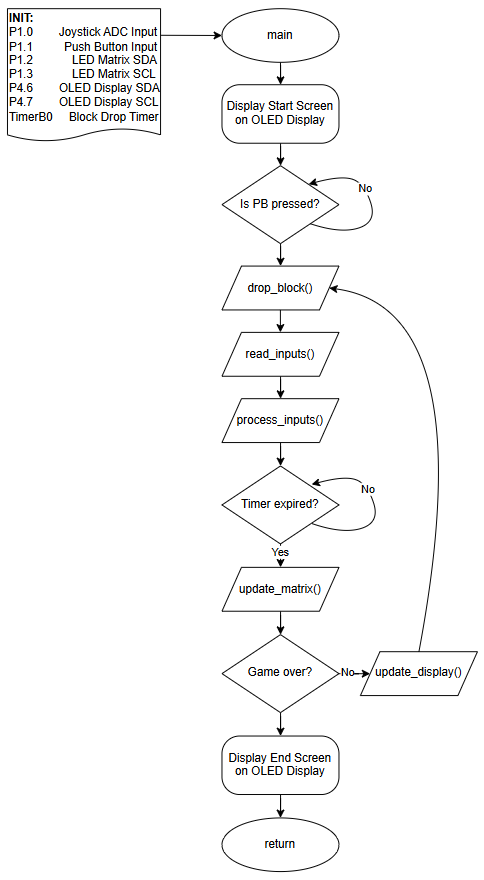

# Final project proposal

- [x] I have reviewed the project guidelines.
- [x] I will be working alone on this project.
- [x] No significant portion of this project will be (or has been) used in other course work.

## Embedded System Description

This project will implement a playable version of Tetris on an embedded system. The game will feature falling blocks that the player can control using a joystick to move them left or right and a push button to rotate them. Completed rows will be cleared, the score will increase, and the game will continue until new blocks can no longer spawn.
The joystick will be used to control horizontal movement of the falling Tetris blocks. The push button will allow the player to rotate the active block during gameplay. The system will track the state of the game grid in real time, process user inputs, detect collisions, clear completed lines, and manage timing for automatic downward movement of blocks. The LED matrix will display the current game state, including both falling and static blocks. The OLED screen will show the player’s score and display instructions or game-over messages at appropriate times.

## Hardware Setup

The system will be built around an MSP430FR2355 microcontroller configured as the I2C master. It will interface with two output devices and two input devices. The primary output will be an 8x16 LED matrix display, constructed from two individual 8x8 LED matrix modules mounted side-by-side. Each matrix will have its own I2C address and will connect to the same I2C bus, which is shared on pins P1.2 (SDA) and P1.3 (SCL) of the MSP430FR2355. This display will be used to visualize the Tetris grid, including active and static blocks. The secondary output will be a small OLED screen, which will display information such as the current score, startup messages, and game-over screens. The OLED will be connected to a separate I2C bus on pins P4.6 (SDA) and P4.7 (SCL). Both I2C buses will include external pull-up resistors as shown in the circuit diagram. The two input devices will be a joystick and a push button. The joystick will be connected to analog input A0 and powered with 3.3V, using its horizontal axis (VRx) to detect left and right movement. The push button will be connected to digital input P1.1 and used to trigger block rotations. Figure 1 shows a conceptual circuit diagram of the full system. Each device is labeled with its relevant signal, power, and ground connections. The diagram also shows the shared ground and 3.3V power rails, along with the required I2C pull-up resistors.

## Software overview

The software will be centered around a real-time game loop running on the MSP430FR2355. Inputs from the joystick and push button will be monitored continuously. The joystick will be sampled using ADC conversions to determine horizontal direction. A threshold-based method will interpret the joystick input as either a left or right movement command. The push button will be monitored using an interrupt-driven GPIO to trigger block rotations. A software timer will be used to control the falling speed of the active Tetris block. This timer will periodically update the vertical position of the current block. As blocks move, the software will check for collisions against existing static blocks or the bottom boundary of the game field. When a collision is detected, the active block will be converted into static blocks, and a new block will be spawned at the top of the grid. The game state will be represented by a 2D array that models the grid, where each cell will track whether it is occupied by part of a static block or is empty. The position of the active, falling block will be tracked separately and updated with each timer tick or player input. After a block lands, the software will scan the array to check for completed lines and will clear them accordingly, updating the score as needed. I2C communication will be used to update the LED matrix and OLED display. For the LED matrix, the software will translate the 2D grid state into pixel data for the two 8x8 matrices. For the OLED screen, the software will send formatted score and status messages based on changes in game state. Display updates will be triggered only when changes occur to reduce unnecessary I2C traffic.The diagram below shows a high-level flowchart of the system software.

## Testing Procedure

Each hardware component will be tested individually to confirm functionality before integration. The joystick will be tested by reading raw ADC values and verifying that left and right movements produce stable, distinct output ranges. The push button will be tested using serial output and a logic analyzer to ensure clean, debounced digital transitions. The LED matrix will be tested by writing known pixel patterns to each 8x8 section to verify correct I2C addressing and visual output alignment. The OLED display will be tested by sending fixed strings and score values to confirm proper formatting and screen updates. Once individual hardware tests are complete, all components will be integrated into a single control script. This script will verify correct I2C communication timing and interaction between devices. Basic gameplay scenarios, such as block drops, user movement inputs, rotations, and line clears, will be simulated to confirm accurate collision handling and state transitions. Timing will be evaluated by measuring block fall intervals and verifying that they match expected game speeds. The final demo will consist of playing a complete round of Tetris using the joystick and push button, demonstrating gameplay on the LED matrix and score tracking on the OLED. All required components will be self-contained and powered on a lab bench with no external equipment needed.

## Prescaler

Desired Prescaler level: 

- [x] 100%
- [ ] 95% 
- [ ] 90% 
- [ ] 85% 
- [ ] 80% 
- [ ] 75% 

### Prescalar requirements 

**The inputs to the system will be:**
1.  The joystick will be connected to an analog input pin and read using the MSP430’s ADC. It will be used to control the horizontal movement of falling Tetris blocks by detecting left and right tilt based on voltage thresholds.
2.  The push button will be connected to a digital GPIO pin and used to rotate the active Tetris block. It will be monitored using an interrupt to ensure responsive input during gameplay.

**The outputs of the system will be:**
1.   The LED matrix display will consist of two 8x8 I2C-controlled matrices arranged side-by-side to form an 8x16 grid. It will visually display the Tetris game board, including falling and static blocks.
2.   The OLED screen will be connected via I2C and used to display the player's score, startup messages, and game-over screens. It will update in response to game state changes.

**The project objective is**

The project objective is to design and implement a playable version of Tetris on an embedded system using the MSP430FR2355. The game will feature real-time user input, dynamic block movement, score tracking, and visual output on both an LED matrix and OLED screen.

**The new hardware or software modules are:**
1. LED Matrix hardware and software: The LED matrix is a new display component consisting of two I2C-controlled 8x8 matrices. Software will need to manage address mapping, pixel control, and real-time updates to reflect game state.
2. The OLED screen is a new output device that will require initialization, character rendering, and I2C communication routines to display game messages and score updates.
3. Joystick hardware: New hardware component; similar ADC-based input will be used in other projects.
4. Push button hardware: New hardware component; similar GPIO input handling will be implemented in other projects.

**The Master will be responsible for:**

The Master will be responsible for processing inputs from the joystick and push button, executing game logic, and managing all I2C communication. It will update the LED matrix with the current game state and send score and status updates to the OLED screen.

**The Slave(s) will be responsible for:**

The LED matrix and OLED screen are I2C slave devices that will respond to commands from the master microcontroller. They will handle visual output by displaying the game board and score information based on data received from the master.

### Argument for Desired Prescaler

I believe this project warrants a prescalar of 100% based on its software complexity, system integration, and the added challenge of working with undocumented hardware. While the project includes two inputs (a joystick read via ADC and a push button) and two outputs (an 8x16 LED matrix display and an OLED screen) and meets the master/slave topology requirement through I2C communication with both displays, it does not meet the strict hardware count requirement for the 100% prescalar. However, the overall difficulty is significantly elevated by the software demands of implementing a real-time Tetris game. The project requires tracking and updating a dynamic 8x16 grid with falling, rotating, and stacking blocks, detecting line completions, and managing real-time user input—all on a resource-constrained microcontroller. Efficiently rendering the grid to two I2C-connected LED matrix devices while maintaining smooth, accurate gameplay adds to the system’s complexity. Additionally, the LED matrix was sourced from AliExpress and arrived without a datasheet or documentation, which introduces substantial difficulty in correctly configuring and communicating with the device. These challenges demand independent troubleshooting, protocol analysis, and creative software solutions, all of which align with the expectations of a 100% prescalar-level project.